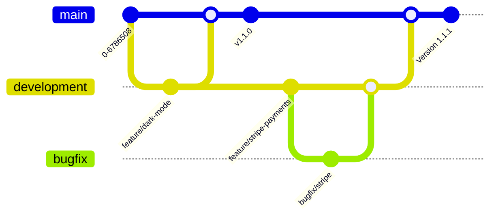

[[Evidence-Version-Control.png]] 

The GitHub repo is used for version control (releases), and minor changes through branches, pulls, and merges. As such names do not need to include version numbers or dates. 

**Naming Files** 
Files should have clear meanings from their title. They **do not** need version control. Documents prone to updates should not have dates, but for meetings or review sessions dates may be appropriate.

**Naming Folders**
All code should live inside of the "code" portion of the repo. Folders inside of this should follow relevant language standards. i.e. Javascript
- src/
- components/
- services/
- utils/

**Naming Branches**, branches should have a prefix tag to make it more readable. 
Development branch should be used for any contributed code awaiting testing protocols.
- Feature/
	Releases of new feature modules
- Bugfix/
	Fixes of errors
- Chore/ 
	Updates resulting from other changes, i.e. changing dependencies
- Refactor/
	Changes in structuring of code. Merging/dividing methods etc..
- Docs/
	Updates to code or project documentation

**Merges** 
The main branch should be reserved for production-ready code. Completed developments should work on a "development" branch which can be tested before being merged to main. 
Main merges should have an associated version release.

**Versions** 
Semantic versioning should be used, this is of the form:
Major.Minor.Patch
Major changes will not support prior versions.
Minor changes add features.
Patches are bug fixes or refactoring optimisations.

