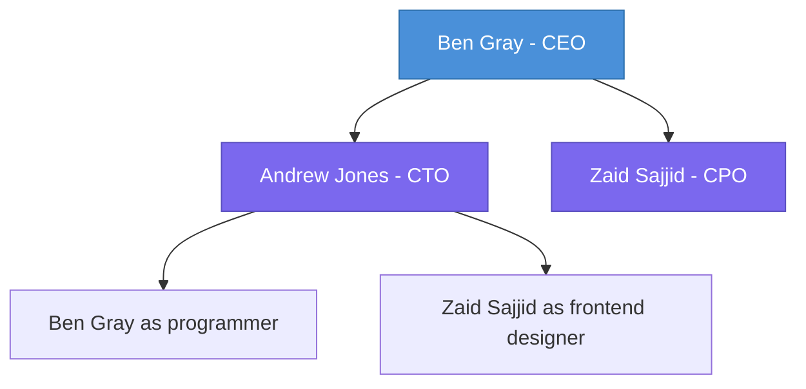

### Team Charter
Team Name:
Mission Statement: To produce a proof of concept booking app to secure funding from a client for development.
Goals & Objectives:
Team Member and Roles:
	Ben Gray, BWG25 - CEO, COO, controls overall direction and implements strategy
	Andrew Jones, AJ - CTO, driving product development
	Zaid Sajjid, ZS829 - Chief Product Officer, leading design and user experience
### Skills Matrix

|                   | Ben | Zaid | Andrew |
| ----------------- | :-: | :--: | :----: |
| Documentation     |  3  |      |        |
| Change Control    |  4  |      |        |
| Time Management   |  2  |      |        |
| Graphic Design    |  2  |      |        |
| Data handling     |  3  |      |        |
| Javascript        |  3  |      |        |
| Business analysis |  4  |      |        |
| Presentation      |  3  |      |        |

### Communication of Controversy with Civility
- Every team member wants to get the most learning out of this project. 
- **Never** attack a person as a way to discredit their ideas. 
- Disagreements should be voiced, input is valuable and lack of input can leave people left out.
- The third member can mediate any disputes in this project, and act as tie-break for technical decisions.
### Organisation Chart

### Team Management tools
- Task and project management:
	- Design and development matrix (shared file)
	- Issue tracking and task assignment on GitHub projects.
- Communication and collaboration:
	- Whatsapp groupchat for mobile ease and security.
- Time tracking and productivity:
	- Initial plan produced in Microsoft Project. 
	- Continuous tracking in Github projects and through issues.
- Reporting and analytics:
	- PostHog used for issue reporting, session replay, web analytics, and experiment rollouts.
	- [[PostHog]] 
- Knowledge and documentation:
	- Central Github repo used for documentation and tracking research
	- Obsidian used (optionally) to edit markdown files and navigate files more easily, syncing with the repo.
