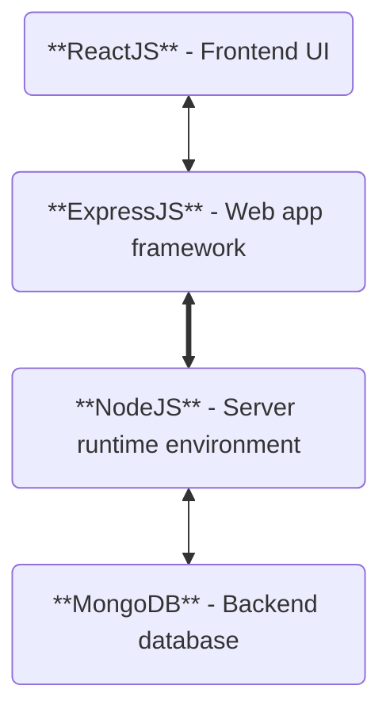

**Chosen stack is MERN; MongoDB, ExpressJS, ReactJS, NodeJS**
[https://www.youtube.com/watch?v=4nKWREmCvsE](MERN Tutorial)

```mermaid
flowchart TD
    A(**ReactJS** - Frontend UI) <--> B(**ExpressJS** - Web app framework )
    B <==> C(**NodeJS** - Server runtime environment)
    C <--> D(**MongoDB** - Backend database)

```
