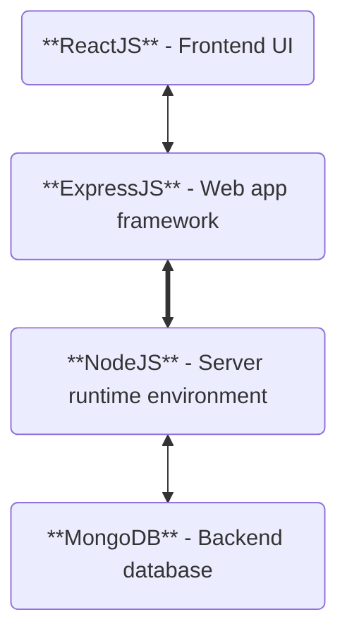

**Chosen stack is MERN; MongoDB, ExpressJS, ReactJS, NodeJS**
[QuickGuide](https://www.youtube.com/watch?v=4nKWREmCvsE)
**Cost**: Open-sourced technologies so no licensing costs. 
	5/5
**Dev time**: Shortened due to per-built UI elements in react, and being entirely in javascript.
	4/5
**Documentation/support**: One of the most popular full-stack-frameworks so has lots of support
	4/5
**Compatibility**: Javascript is used for most modern web-apps and is supported by cloud hosting services. May not work on very old browsers.
	4/5

### Alternatives
- MEAN
	- Replaces Node with Angular